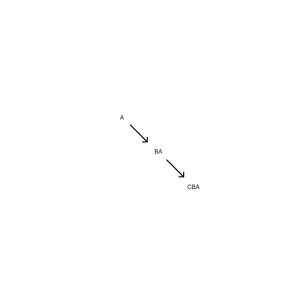

<link rel="stylesheet" href="../_res/darkmode.css">

ㄴ기호
ㄴ동일결론사용
ㄴ->다른결론필한경우있음
ㄴ더들어가되
ㄴ결론이꺾이는경우.
ㄴ"ㄴ"기호쓸수있으나
ㄴ기존규칙성
ㄴ알게모르게
ㄴ싹다같은것들
ㄴ싹다-ㄴ형식으로처리
ㄴ그다음직감력
ㄴ"ㄴ"기호사용경우
ㄴ혼동가능성존재
ㄴ비최적
최적위해
ㄴ혼선줄임
ㄴ1기호1의미
ㄴ공백문자활용ㄱㄱ.
ㄴㅁ형식도괜찮으나.
ㄴ일단공백문자있기에
ㄴ당해활용ㄱㄱ.!!!
오
ㄴㆍ얘도좋은데?!
ㄴ얘도한글이잖아. ㅎㅎㅎㅎ.
ㄴ개꿀.
결국
ㄴ ㄴ ㅁ ㆍ "ㅤ"
ㄴ ㄴ탈락->동일결론형
ㄴ상이결론택ㄱㄱ.
ㄴㅁ->다른것들 좋은것있음.
ㄴ최하위
ㄴㆍ "ㅤ"
ㄴ이두개중.

예시로
#
금전채권ㅤㅤㅤㅤㅤㅤㅤ▶보전필요성  
ㅤㄴ밀접관련성금전채권▶보전필요성  
ㄴ무자력금전채권ㅤㅤㅤ▶보전필요성  
특정채권ㅤㅤㅤㅤㅤㅤㅤ▶보전필요성  

금전채권ㅤㅤㅤㅤㅤㅤㅤ▶보전필요성  
ㅤㆍ밀접관련성금전채권▶보전필요성  
ㆍ무자력금전채권ㅤㅤㅤ▶보전필요성  
특정채권ㅤㅤㅤㅤㅤㅤㅤ▶보전필요성  

금전채권ㅤㅤㅤㅤㅤㅤㅤ▶보전필요성  
ㅤㅤ밀접관련성금전채권▶보전필요성  
ㅤ무자력금전채권ㅤㅤㅤ▶보전필요성  
특정채권ㅤㅤㅤㅤㅤㅤㅤ▶보전필요성  

ㄴ이짜세긴한데.
ㄴ흠.

#
아
예외부분.
어떻게든줄이고자
순서
상하에서
갑자기위로
ㄴ하상
ㄴ이런식으로가지말것.
ㄴ규칙성깨짐.
ㄴ철저히지킬것.!!!

#
하위로간다면  

금전채권ㅤㅤㅤㅤㅤㅤㅤ▶보전필요성  
ㄴ무자력금전채권ㅤㅤㅤ▶보전필요성  
ㅤㄴ밀접관련성금전채권▶보전필요성  
특정채권ㅤㅤㅤㅤㅤㅤㅤ▶보전필요성  

금전채권ㅤㅤㅤㅤㅤㅤㅤㅤㅤ▶보전필요성  
ㄴ무자력금전채권ㅤㅤㅤㅤㅤ▶보전필요성  
ㅤㄴ밀접관련성자력금전채권▶보전필요성  
특정채권ㅤㅤㅤㅤㅤㅤㅤㅤㅤ▶보전필요성  

표현
ㄴ여기도
ㄴ추가형으로필히갈것.
ㄴ무자력->자력
ㄴ-이게본래는맞기하나.
ㄴ->비무자력으로ㄱㄱ.
ㄴ->계속추가형으로넣어줄것.!!!
ㄴ하위로갈수록
ㄴ하위추가
ㄴ하위추가형
ㄴ기존질서
ㄴ기존규칙성유지위해ㄱㄱ.
ㄴ무자력->비무자력
ㄴ->이게훨씬더직감적.!!!
ㄴ하위추가>>하위생략
ㄴ생략->상위
ㄴ생략상위
ㄴ상위생략
ㄴ상위간결
ㄴ->당해규칙성을계속유지하는격.!!!
ㄴ이게너무도중한듯함.
ㄴ이또한
ㄴ깨질경우
ㄴ상하
ㄴ원칙예외
ㄴ이부분꼬이는것처럼.
ㄴ상하
ㄴ생략추가
ㄴ추상구체
ㄴ이또한꼬임.!!!
ㄴ결국
ㄴ다무너짐.
최적화위해
ㄴ규칙유지해야함.
ㄴ일단유지하고.
ㄴ그다음에서야
ㄴ줄이든말든
ㄴ그건ㅇㅋ.
그러나
ㄴ일단기준은
ㄴ무조건적으로
ㄴ붙여야함.
ㄴ추가해야함.
ㄴ구체화해야함.
ㄴ구체해야함.
ㄴ더하여야함.
ㄴ->빼지말고.!!!
ㄴ->생략말고.
ㄴ->방향꺾지말고.!!!
ㄴ이걸유지해야함.
최적결론
ㄴ상하방향유지
ㄴ상하첨가유지

금전채권ㅤㅤㅤㅤㅤㅤㅤㅤㅤㅤㅤ▶보전필요성  
ㄴ무자력금전채권ㅤㅤㅤㅤㅤㅤㅤ▶보전필요성  
ㅤㄴ밀접관련성비무자력금전채권▶보전필요성  
특정채권ㅤㅤㅤㅤㅤㅤㅤㅤㅤㅤㅤ▶보전필요성  

근데...
답이없다.
그냥
여기서최적화뽑을수있느내로가는게
맞는듯함.
최적화ㄱㄱ.
계속더최적화ㄱㄱ.
답이없다.
ㄴ금전채권도
ㄴ애당초
ㄴ저쪽을원칙으로잡았으나.
ㄴ무자력금전채권->이걸원칙으로잡아버리면
ㄴ그냥상당히배치가편해짐.
ㄴ아싸리
ㄴ이렇게배치해버리고.
금전채권-특정채권
ㄴ양자대립구도보다
ㄴ요건기준
ㄴ결론기준
무자력금전채권-특정채권
ㄴ이런식으로
ㄴ동준위로
ㄴ처버리며
ㄴ덩어리화로가는게
ㄴ더나을수도있을듯함.
ㄴ그러면
ㄴ중간위계가
ㄴ너무도자연스럽게
ㄴ잘빠짐.!!!

무자력
비무자력
밀접관련성비무자력
...
ㄴ결국.
ㄴ그냥배치나름이고.
ㄴ배치간의
ㄴ최적화를
ㄴ얼마나
ㄴ어떻게구현하느냐.
특히
ㄴ트리구조
ㄴ위계구조
ㄴ얘들을
ㄴ어떻게처리하느냐가
ㄴ최적화
ㄴ가르는듯함.
ㄴ계속가보자.
근데.
ㄴ확실히
ㄴ덩어리화.
ㄴ이게더맞는듯함.!!!
ㄴ덩어리화->위계줄임->최적구조
ㄴ상당히스킬적이고
ㄴ너무도좋음.
더하여
ㄴ종래고민했던
ㄴ덩어리화
ㄴ역순형.
ㄴ이렇게가고.
이제는
ㄴ덩어리자체를
ㄴ원칙화
ㄴ원칙.
ㄴ여기까지배치해버려서
ㄴ아싸리
ㄴ부스팅처럼가버리는.
ㄴ그러면상당히좋을듯함.
ㄴ오히려이게더
ㄴ맞을수도.

무자력금전채권ㅤㅤㅤㅤㅤㅤ▶보전필요성  
비무자력금전채권ㅤㅤㅤㅤㅤ▶보전필요성  
밀접관련성비무자력금전채권▶보전필요성  
특정채권ㅤㅤㅤㅤㅤㅤㅤㅤㅤ▶보전필요성  

+글고
ㄴ특정채권
ㄴ얘들하고
ㄴ상단
ㄴ금전채권
ㄴ비구별되기에.
ㄴ그러면
ㄴ기호하나쏙ㄱㄱ.
ㄴ-
ㄴ상당히좋은데?!
ㄴ단번에구분됨.
ㄴ그렇게원하던
ㄴ평소목록기호랑
ㄴ아싸리단번에.ㅎㅎㅎㅎ.

결국
ㄴ오
ㄴ규칙성하나나온다.
상이결론->그대로
동일결론->(-)기호
ㄴ(-)기호로
ㄴ영역분할동시에
ㄴ동일결론
ㄴ동일출발
ㄴ동출발
ㄴ단번에직감화ㄱㄱ.!!!
ㄴㅎㅎㅎ.
ㄴ최적화
ㄴ좀찾은듯하다.
ㄴㄱㄱ.!!!

- 무자력금전채권ㅤㅤㅤㅤㅤㅤ▶보전필요성  
  비무자력금전채권ㅤㅤㅤㅤㅤ▶보전필요성  
  밀접관련성비무자력금전채권▶보전필요성  
- 특정채권ㅤㅤㅤㅤㅤㅤㅤㅤㅤ▶보전필요성  
ㄴ결국에는
ㄴ결론위주
ㄴ요건보다도
ㄴ결론위주로
ㄴ요건들을
ㄴ배치하는형태.
ㄴ이게오히려
ㄴ가면갈수록
ㄴ더맞는듯함.
ㄴㄱㄱ.!!!
ㄴ결론실익학문이고.
ㄴ이게전부임.
ㄴ이다아니다.
ㄴ이판단을할줄아냐모르냐
ㄴ이싸움이고.
ㄴ당해형태로ㄱㄱ.

결론
ㄴ상하방향유지
ㄴ상하첨가유지
ㄴ상이결론▶그대로
ㄴ동일결론▶(-)기호

